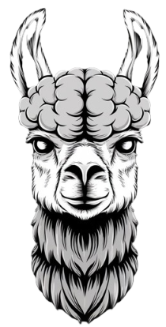
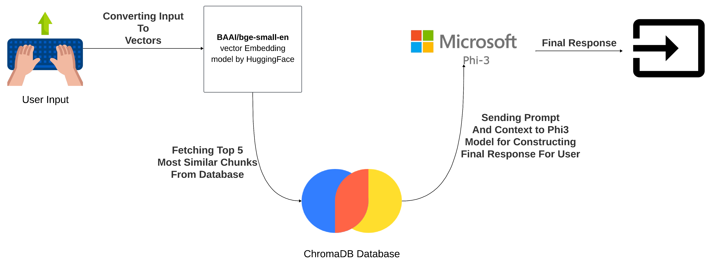
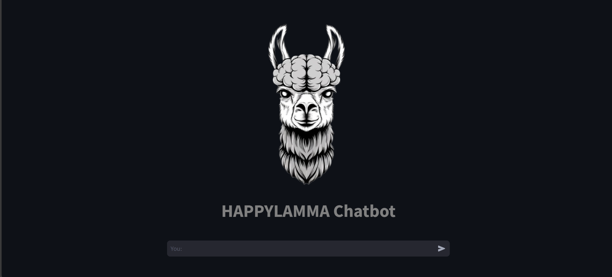
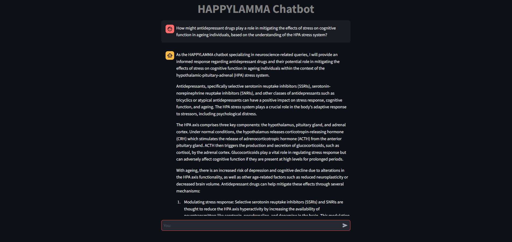

    

# HAPPYLAMMA Chatbot
Welcome to the HAPPYLAMMA, a RAG-Based Chatbot for neuroscience. This project utilizes the power of Retrieval-Augmented Generation (RAG) to deliver an advanced and interactive chatbot designed to answer questions and provide insights on neuroscience topics. By integrating the Ollama platform to run the Phi3 large language model (LLM) locally, the chatbot leverages sophisticated natural language processing capabilities. The system uses Chroma DB as a vector database to efficiently store and retrieve relevant information. For the frontend, LangChain is employed to manage the conversational flow, and Streamlit is used to create an intuitive and user-friendly interface.

## Dataset:
1. Science of the brain: An Introduction For Young Students: [Link](https://www.bna.org.uk/static/uploads/resources/BNA_English.pdf)
2. Complexity and the Nervous System: [Link](https://www.researchgate.net/publication/235239251_Complexity_and_the_Nervous_System)
3. Action potential initiation and backpropagation in neurons of the mammalian CNS: [Link](https://pubmed.ncbi.nlm.nih.gov/9061867/)
4. Changes in neuron structure during action potential propagation and synaptic transmission: [Link](https://www.researchgate.net/publication/18815757_Changes_in_neuron_structure_during_action_potential_propagation_and_synaptic_transmission)
5. The autonomic nervous system: [Link](https://archive.org/details/autonomicnervous01languoft/page/n9/mode/2up)
6. The Brain: A User's Guide: [Link](https://www.amazon.com/Brain-Users-Guide-New-Scientist/dp/1473685060)

## Workflow:

    

This project utilizes a structured workflow to process user input and generate meaningful responses using a combination of vector embedding and advanced language models. The workflow is detailed as follows:

1. **User Input**: The process begins when the user provides an input, typically in the form of a text query.

2. **Converting Input to Vectors**:
   - The user's input is converted into vectors using the `BAAI/bge-small-en` vector embedding model provided by HuggingFace.
   - This model transforms the input text into a numerical vector representation that captures the semantic meaning of the text.

3. **Fetching Top 5 Most Similar Chunks from Database**:
   - The vector representation of the input is then used to query a `ChromaDB` database.
   - The database retrieves the top 5 most similar chunks of text based on the vector similarity. These chunks are the most contextually relevant pieces of information related to the user's input.

4. **Sending Prompt and Context to Phi-3 Model**:
   - The selected text chunks, along with the original user input, are sent to the `Phi-3` model from Microsoft.
   - This step involves constructing a comprehensive prompt that includes both the user's query and the contextual information fetched from the database.

5. **Final Response**:
   - The `Phi-3` model processes the prompt and generates a final response.
   - This response is then delivered back to the user, completing the interaction.

This workflow ensures that the response is not only generated based on the user's input but is also enriched with relevant contextual information, leading to more accurate and helpful outcomes.

## Instructions to Run
1. Download Ollama from [here](https://ollama.com/) to run phi3 model locally.
2. Open terminal and run `ollama run phi3`. This will download phi3 LLM model by microsoft and will start running it locally.
3. Open another terminal and run `git clone https://github.com/HAPPYLAMMA2001/happylamma-chatbot.git` to clone this repository.
4. Navigate to `happylamma-chatbot` directory.
5. Install required library by running `pip install -r requirements.txt`.
6. Run `streamlit run app.py` to run chatbot and enjoy.

## Chatbot Interface

    

    

> **Note**: This project is intended solely for educational purposes and is not for commercial use. Additionally, the dataset used for this project is not provided.